# Questions

I successfully ran TC-003 TC-003 -> ICA Transfer — Active SpanEnrolled (active, SU synced)Enrolled (new ICA agency), how to I confirm that application changes were performed correctly. I think this test case is failing to create time spans on Waiver Enrollment side.

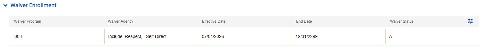

```typescript
bcInput: {
      enrollmentStartDate: '07/01/2026',
      enrollmentEndDate: '12/31/2299',
      agencyChange: { oldAgency: 'ICA-001', newAgency: 'ICA-002', effectiveDate: '10/01/2026' },
    },
    mmisBefore: [
      { label: 'Span-B', status: 'A', beginDate: '07/01/2026', endDate: '12/31/2299', agency: 'ICA-001' },
    ],
    mmisAfter: [
      { label: 'Span-B', status: 'A', beginDate: '07/01/2026', endDate: '09/30/2026', agency: 'ICA-001' },
      { label: 'Span-C', status: 'A', beginDate: '10/01/2026', endDate: '12/31/2299', agency: 'ICA-002' },
    ],
    transactions: [
      { sequence: 1, scenario: 'S600', type: 'C', status: 'A', startReason: '2P', stopReason: '2P', description: 'Close span with old ICA' },
      { sequence: 2, scenario: 'S610', type: 'O', status: 'A', startReason: '2P', description: 'Create span with new ICA' },
    ],
```

How do I verify this? and why I am not seeing the bands in MMIS. Secondly how to create a new plan? What does this mean? 

What is ITC? 

What are valid agencies to select from

same for TC-016, TC-019, TC-020


Must add a test step to make sure that benefit plan and othe pieces as show bellow must be populated. How do we make sure that this is populated? FSIA record will populate these section. 

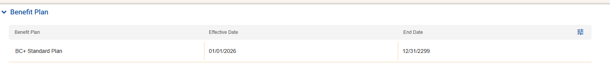

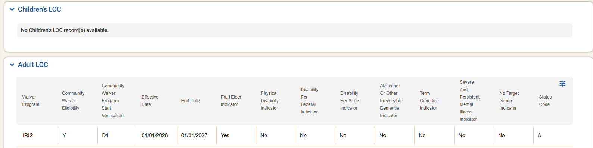

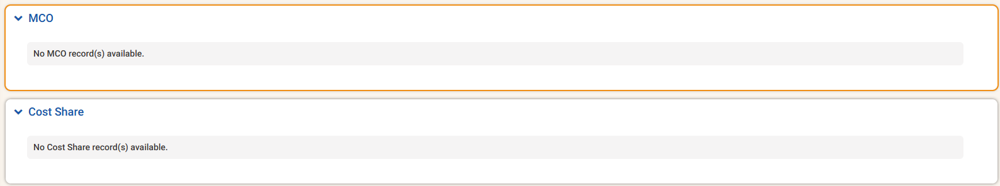

This is how you add or revise an existing ISP

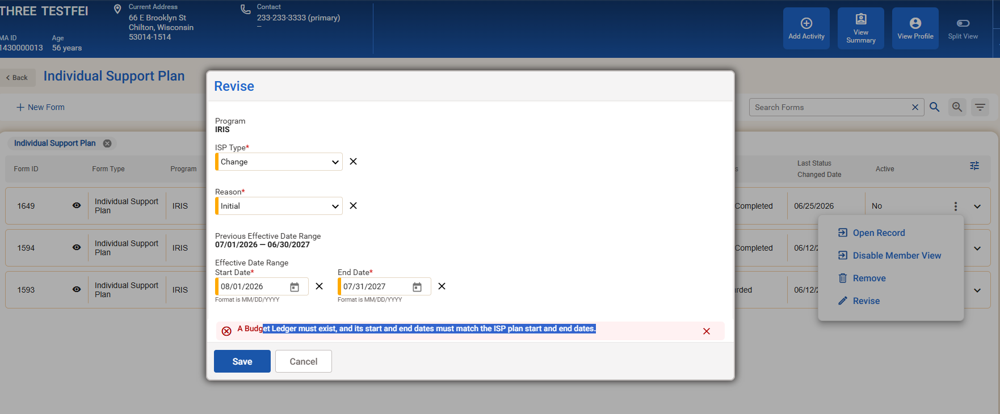


When you create a future enrollment, this is expected result check for warning or success only FL is failure. 

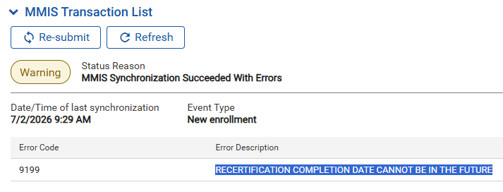

Possible Bug: deleted suspecsion and the MMIS hasn't reset the span. We need to verify our code to make sure that we are sending correct data.,

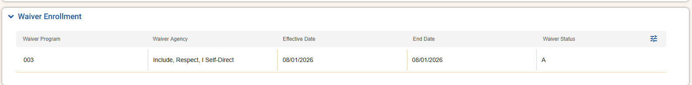

use this to fix the End Date before doing any other transaction. The Enrollment End date set to blank. 

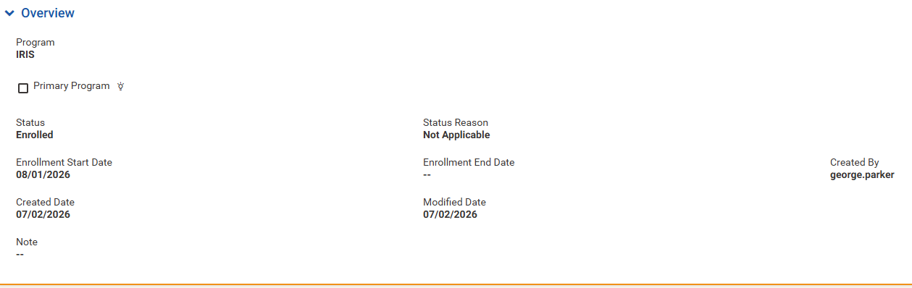


TC-003 How do we change Agency, Assignment Type and Active must be unique. 

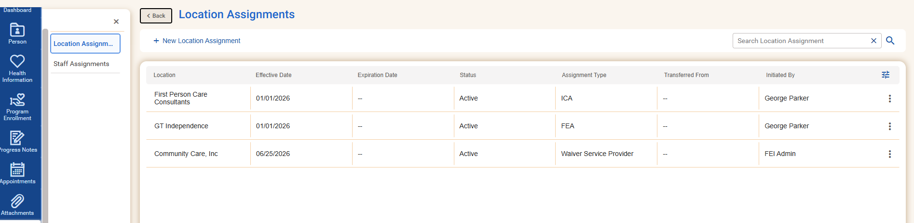

To trigger TC-003 following must be set.

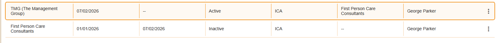


To solve this error ==>

| Error Code | Error Description                   |
| ---------- | ----------------------------------- |
| 9133       | THE WORKER ID IS INVALID OR MISSING |

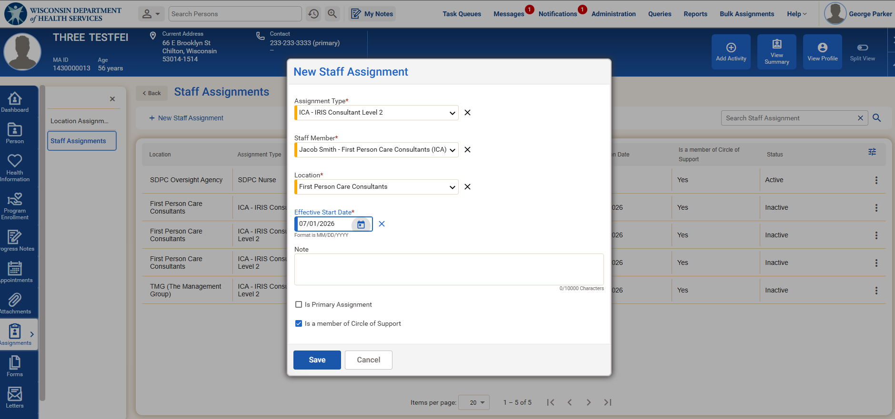
