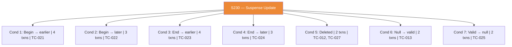
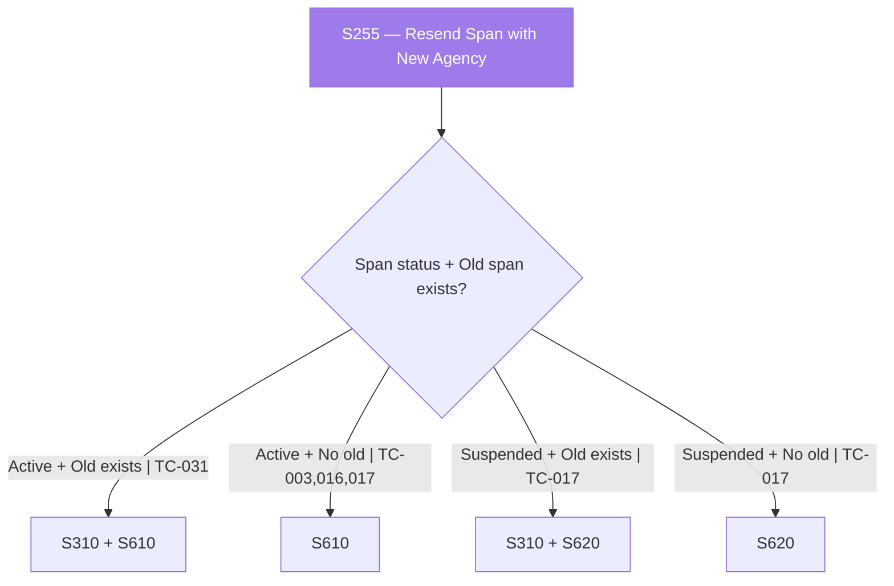
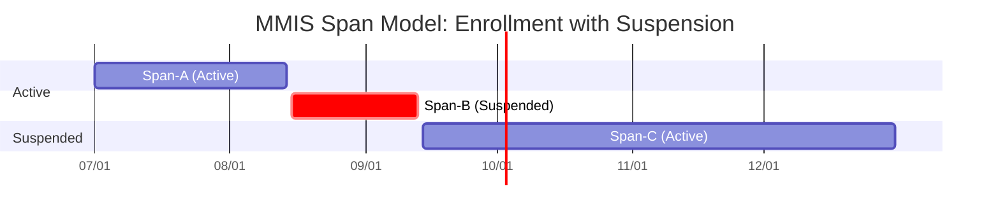

# Enrollment Service — Test Case Inventory & Scenario Coverage

**Feature:** Enrollment Service (ICD-D01 V6.0)  
**Test Participant:** MA ID 1430000012  
**Total Test Cases:** 32  
**Last Updated:** 2026-06-28  

---

## Index

1. [Summary](#summary)
2. [Test Case Inventory](#test-case-inventory)
3. [Scenario Flow Diagrams](#scenario-flow-diagrams)
4. [Requirements Traceability Matrix](#requirements-traceability-matrix)
5. [Decision Table Condition Coverage](#decision-table-condition-coverage)
   - [S100 Trigger Conditions](#s100-trigger-conditions)
   - [S220 Enrollment Conditions](#s220-enrollment-conditions)
   - [S230 Suspension Update Conditions](#s230-suspension-update-conditions)
   - [S240 Suspension Add Conditions](#s240-suspension-add-conditions)
   - [S250 Location Assignment Conditions](#s250-location-assignment-conditions)
   - [S255 Resend Span with New Agency Conditions](#s255-resend-span-with-new-agency-conditions)
   - [S350 End Date Later Conditions](#s350-end-date-later-conditions)
   - [S700 Address-Only Update Conditions](#s700-address-only-update-conditions)
6. [Leaf Scenario (Transaction Builder) Coverage](#leaf-scenario-transaction-builder-coverage)
7. [Test Execution Order (Recommended)](#test-execution-order-recommended)
8. [Open Question (Unresolved)](#open-question-unresolved)
9. [Key References](#key-references)
10. [Glossary](#glossary)

---

## Summary

| Metric | Value |
|--------|-------|
| Total Test Cases | 32 |
| IRIS Test Cases | 28 |
| SDPC Test Cases | 4 |
| Happy Path (SU expected) | 27 |
| Error / Negative Cases | 4 (TC-004 FL, TC-011 no txn, TC-029 FL multi, TC-032 no txn) |
| Edge Cases | 1 (TC-030 SE response) |
| Single-Transaction Tests | 13 |
| Multi-Transaction Tests (2 txns) | 9 |
| Multi-Transaction Tests (3 txns) | 6 |
| Multi-Transaction Tests (4 txns) | 2 |
| Zero-Transaction Tests | 2 (TC-011, TC-032) |
| Business Rules Covered | 24 of 24 (BR-D01-001 through BR-D01-024) |
| S100 Trigger Coverage | 11 of 11 (100%) |
| S220 Condition Coverage | 7 of 7 (100%) |
| S230 Condition Coverage | 7 of 7 (100%) |
| S240 Condition Coverage | 3 of 3 (100%) |
| S250 Condition Coverage | 2 of 2 (100%) |
| S255 Condition Coverage | 4 of 4 (100%) |
| S350 Condition Coverage | 2 of 2 (100%) |
| S700 Condition Coverage | 2 of 2 (100%) |

---

## Test Case Inventory

| TC # | Scenario | Program | Txns | Decision Table Path | Expected |
|------|----------|---------|------|---------------------|----------|
| TC-001 | New IRIS Enrollment — Happy Path | IRIS | 1 | S100(1)→S200→S220(1)→**S300** | SU |
| TC-002 | Enrolled → Suspended (with end date) | IRIS | 3 | S100(3)→S200→S240(1)→**S500+S510+S520** | SU |
| TC-003 | ICA Transfer — Active Span | IRIS | 2 | S100(6)→S200→S250(1)→**S600+S255(2)→S610** | SU |
| TC-004 | Hard Error — FEA Dates Don't Span | IRIS | 1 | S100(1)→S200→S220(1)→**S300** | FL (9156) |
| TC-005 | Medicaid ID Mismatch (BR-D01-016) | IRIS | 1 | S100(1)→S200→S220(1)→**S300** | SU + ID swap |
| TC-006 | End Date → Earlier (Disenrollment) | IRIS | 1 | S100(2)→S200→S220(4)→**S340** | SU |
| TC-007 | End Date → Later (Extension) | IRIS | 1 | S100(2)→S200→S220(5)→**S350**(2) | SU |
| TC-008 | Enrolled → Referral Withdrawn | IRIS | 1 | S100(2)→S200→S220(6)→**S310** | SU |
| TC-009 | Disenrolled → Enrolled (Reinstatement) | IRIS | 1 | S100(2)→S200→S220(7)→**S300** | SU |
| TC-010 | Open-Ended Suspension (no end date) | IRIS | 2 | S100(3)→S200→S240(2)→**S500+S510** | SU |
| TC-011 | Suspension < 3 Days (Error) | IRIS | 0 | S100(3)→S200→S240(3)→⛔ | No Txn |
| TC-012 | Suspension Deleted | IRIS | 2 | S100(4)→S200→S230(5)→**S410+S470** | SU |
| TC-013 | Suspension End: Null → Valid | IRIS | 2 | S100(4)→S200→S230(6)→**S440+S520** | SU |
| TC-014 | Address-Only Update (S700 Cond 1) | IRIS | 1 | S100(11)→S200→**S700**(1) | SU |
| TC-015 | New SDPC Enrollment | SDPC | 1 | S100(7)→S210→S220(1)→**S300**(Col2) | SU |
| TC-016 | FEA Transfer — Close + Open | IRIS | 2 | S100(5)→S200→S250(1)→**S600+S255(2)→S610** | SU |
| TC-017 | ICA Transfer During Suspension | IRIS | 3 | S100(6)→S200→S250(2)→**S600(2)+S255(3/4+2)→S620+S610** | SU |
| TC-018 | New SDPC Suspension | SDPC | 3 | S100(9)→S210→S240(1)→**S500+S510+S520**(Col2) | SU |
| TC-019 | Begin Date → Earlier (Delete+Recreate) | IRIS | 2 | S100(2)→S200→S220(2)→**S310+S300** | SU |
| TC-020 | Begin Date → Later (Delete+Recreate) | IRIS | 2 | S100(2)→S200→S220(3)→**S310+S300** | SU |
| TC-021 | Suspension Begin → Earlier (S230_001) | IRIS | 4 | S100(4)→S200→S230(1)→**S400+S410+S300+S510** | SU |
| TC-022 | Suspension Begin → Later (S230_002) | IRIS | 3 | S100(4)→S200→S230(2)→**S410+S510+S400** | SU |
| TC-023 | Suspension End → Earlier (S230_003) | IRIS | 4 | S100(4)→S200→S230(3)→**S410+S310+S510+S520** | SU |
| TC-024 | Suspension End → Later (S230_004) | IRIS | 3 | S100(4)→S200→S230(4)→**S310+S445+S520** | SU |
| TC-025 | Suspension End: Valid → Null (S230_007) | IRIS | 2 | S100(4)→S200→S230(7)→**S310+S445** | SU |
| TC-026 | SDPC End Date → Earlier (Disenrollment) | SDPC | 1 | S100(8)→S210→S220(4)→**S340**(Col2) | SU |
| TC-027 | SDPC Suspension Deleted | SDPC | 2 | S100(10)→S210→S230(5)→**S410+S470**(Col2) | SU |
| TC-028 | End Date Later + Last Span Suspended | IRIS | 1 | S100(2)→S200→S220(5)→S350(1)→**S360** | SU |
| TC-029 | Multiple MMIS Error Segments | IRIS | 1 | S100(1)→S200→S220(1)→**S300** | FL (multi) |
| TC-030 | SE Response — Enrollment Activated | IRIS | 1 | S100(1)→S200→S220(1)→**S300** | SE |
| TC-031 | ICA Transfer — Span-C Exists (S255_001) | IRIS | 3 | S100(6)→S200→S250(1)→**S600+S255(1)→S310+S610** | SU |
| TC-032 | Address Update — No Current Span (S700 Cond 2) | IRIS | 0 | S100(11)→S200→**S700**(2)→⛔ | No Txn |

---

## Scenario Flow Diagrams

### Master Flow: S100 Entry Points → Downstream Scenarios

```mermaid
flowchart TD
    S100["S100 — START"] --> S200["S200 — Calc IRIS Spans"]
    S100 --> S210["S210 — Calc SDPC Spans"]
    S100 --> S220["S220 — Enroll Add/Update"]
    S100 --> S230["S230 — Suspense Update"]
    S100 --> S240["S240 — Suspense Add"]
    S100 --> S250["S250 — Location Assignment"]
    S100 --> S700["S700 — Address Update"]

    S220 --> S300["S300 — Create Enrollment"]
    S220 --> S310["S310 — Delete Enrollment"]
    S220 --> S340["S340 — End Date Earlier"]
    S220 --> S350["S350 — End Date Later"]
    S350 --> S360["S360 — Span After Suspension"]

    S230 --> S400["S400 — Update Span-A End"]
    S230 --> S410["S410 — Delete Suspense"]
    S230 --> S310
    S230 --> S300
    S230 --> S510["S510 — Add Suspense"]
    S230 --> S520["S520 — Create Span-C"]
    S230 --> S440["S440 — Suspense End Earlier"]
    S230 --> S445["S445 — Suspense End Later"]
    S230 --> S470["S470 — Span-A End Later"]

    S240 --> S500["S500 — Close Span-A"]
    S240 --> S510
    S240 --> S520

    S250 --> S600["S600 — Close for Agency"]
    S250 --> S255["S255 — Resend w/ New Agency"]
    S255 --> S310
    S255 --> S610["S610 — Active + New Agency"]
    S255 --> S620["S620 — Suspended + New Agency"]

    style S100 fill:#2d3748,color:#fff
    style S200 fill:#4299e1,color:#fff
    style S210 fill:#4299e1,color:#fff
    style S220 fill:#48bb78,color:#fff
    style S230 fill:#ed8936,color:#fff
    style S240 fill:#ed8936,color:#fff
    style S250 fill:#9f7aea,color:#fff
    style S700 fill:#fc8181,color:#fff
```



### S230 Suspension Update — All 7 Conditions (Transaction Sequences)



### S255 Agency Transfer — All 4 Conditions



### MMIS Span Timeline (Example: TC-002 — Suspension)



---

## Requirements Traceability Matrix

| BR / Req | Description | Test Cases |
|----------|-------------|------------|
| BR-D01-001 | Waiver Enrollment status change triggers webservice | TC-001, TC-002, TC-004–TC-013, TC-019–TC-025, TC-028–TC-031 |
| BR-D01-002 | FEA or ICA transfer triggers webservice | TC-003, TC-016, TC-017, TC-031 |
| BR-D01-003 | Address update triggers webservice | TC-014, TC-032 |
| BR-D01-004 | FEA effective dates/status update triggers webservice | TC-016 |
| BR-D01-005 | Most current IRIS span sent for non-enrollment changes | TC-014, TC-032 |
| BR-D01-006 | Demographic update does NOT trigger webservice | *(Verified by absence — no TC triggers on demographics alone)* |
| BR-D01-007 | Enrollment end-dating triggers webservice | TC-006, TC-007, TC-020, TC-026, TC-028 |
| BR-D01-009 | MMIS responses displayed on UI | All TCs except TC-011, TC-032 (no transactions sent) |
| BR-D01-010 | Enrollment not activated unless SU/SE | TC-001, TC-004, TC-005, TC-009, TC-029, TC-030 |
| BR-D01-011 | SDPC status change triggers SDPC webservice | TC-015, TC-018, TC-026, TC-027 |
| BR-D01-012 | SDPC Agency/Dates update triggers webservice | TC-015, TC-026 |
| BR-D01-013 | Demographic update does NOT trigger SDPC webservice | *(Verified by SDPC test structure)* |
| BR-D01-014 | SDPC responses displayed on UI | TC-015, TC-018, TC-026, TC-027 |
| BR-D01-015 | SDPC activated ONLY on SU (not SE) | TC-015, TC-018, TC-026, TC-027 |
| BR-D01-016 | Medicaid ID mismatch handling | TC-005 |
| BR-D01-017 | Suspension start = BC start + 1 day | TC-002, TC-010, TC-011, TC-018, TC-021, TC-022, TC-023, TC-024, TC-027 |
| BR-D01-018 | Suspension end = BC end - 1 day | TC-002, TC-011, TC-013, TC-018, TC-023, TC-024 |
| BR-D01-019 | Minimum 3 calendar days for suspension | TC-002, TC-010, TC-011, TC-018 |
| BR-D01-020 | Status field (A/I/S) determined by context | All TCs with transactions (30 of 32) |
| BR-D01-021 | TransactionType (O/C for IRIS; A/C for SDPC) | All TCs with transactions (30 of 32) |
| BR-D01-022 | Start/Stop Reason Codes per scenario | All TCs with transactions (30 of 32) |
| BR-D01-023 | Residential address: include only if active primary exists | TC-014, TC-032 |
| BR-D01-024 | Mailing address: include only if active exists | TC-014 |
| R370 | HIPAA/CMS security compliance | All (infrastructure level) |
| R385 | Various data exchange methods | All (REST webservice) |
| R386 | Import/integrate data from multiple sources | TC-005 |
| R388 | Matching logic using multiple identifiers | TC-005 |
| R394 | Real-time notification on error/failure | TC-004, TC-005, TC-029 |
| R411 | Maintain program-specific reason codes | All (reason codes per BR-D01-022) |
| R443 | Create/update/inactivate enrollment real-time | TC-001 (create), TC-006/007/028 (update), TC-008 (inactivate) |
| R444 | Incorporate MMIS eligibility editing | TC-004, TC-029 |
| R455 | Automate changes triggered by events | TC-002, TC-003, TC-012, TC-013, TC-016, TC-017, TC-021–TC-025, TC-027, TC-031 |
| R469 | Create/update/inactivate SDPC enrollment real-time | TC-015, TC-018, TC-026, TC-027 |
| Exhibit J.1.a | IRIS two-way real-time web service | All IRIS TCs (28) |
| Exhibit J.1.b | SDPC enrollment distinct type | TC-015, TC-018, TC-026, TC-027 |

---

## Decision Table Condition Coverage

### S100 Trigger Conditions

| # | Trigger | Test Cases |
|---|---------|------------|
| 1 | New IRIS enrollment added | TC-001, TC-004, TC-005, TC-029, TC-030 |
| 2 | Existing IRIS enrollment updated | TC-006, TC-007, TC-008, TC-009, TC-019, TC-020, TC-028 |
| 3 | New IRIS suspension added | TC-002, TC-010, TC-011 |
| 4 | Existing IRIS suspension updated/deleted | TC-012, TC-013, TC-021, TC-022, TC-023, TC-024, TC-025 |
| 5 | FEA assignment updated | TC-016 |
| 6 | ICA assignment updated | TC-003, TC-017, TC-031 |
| 7 | New SDPC enrollment added | TC-015 |
| 8 | Existing SDPC enrollment updated | TC-026 |
| 9 | New SDPC suspension added | TC-018 |
| 10 | Existing SDPC suspension updated/deleted | TC-027 |
| 11 | Address updated (IRIS only) | TC-014, TC-032 |

### S220 Enrollment Conditions

| # | Scenario | Test Cases |
|---|----------|------------|
| 1 | New Enrollment Added | TC-001, TC-004, TC-005, TC-009, TC-015, TC-029, TC-030 |
| 2 | Begin date → earlier | TC-019 |
| 3 | Begin date → later | TC-020 |
| 4 | End date → earlier (disenrollment) | TC-006, TC-026 |
| 5 | End date → later (extension) | TC-007, TC-028 |
| 6 | Enrolled → Referral Withdrawn | TC-008 |
| 7 | Disenrolled → Enrolled (reinstatement) | TC-009 |

### S230 Suspension Update Conditions

| # | Scenario | Test Cases | Txns |
|---|----------|------------|------|
| 1 | Begin date → earlier | TC-021 | 4 (S400→S410→S300→S510) |
| 2 | Begin date → later | TC-022 | 3 (S410→S510→S400) |
| 3 | End date → earlier valid | TC-023 | 4 (S410→S310→S510→S520) |
| 4 | End date → later valid | TC-024 | 3 (S310→S445→S520) |
| 5 | Suspension deleted | TC-012, TC-027 | 2 (S410→S470) |
| 6 | End date: null → valid | TC-013 | 2 (S440→S520) |
| 7 | End date: valid → null | TC-025 | 2 (S310→S445) |

### S240 Suspension Add Conditions

| # | Scenario | Test Cases |
|---|----------|------------|
| 1 | With end date (≥ 3 days) | TC-002, TC-018 |
| 2 | Without end date (open-ended) | TC-010 |
| 3 | < 3 days (error, no txn) | TC-011 |

### S250 Location Assignment Conditions

| # | Scenario | Test Cases |
|---|----------|------------|
| 1 | Span-B is Active | TC-003, TC-016, TC-031 |
| 2 | Span-B is Suspended | TC-017 |

### S255 Resend Span with New Agency Conditions

| # | Span Status | Old Span Exists | Action | Test Cases |
|---|-------------|----------------|--------|------------|
| 1 | Active | Yes | S310 (delete) + S610 (create) | TC-031 |
| 2 | Active | No | S610 (create only) | TC-003, TC-016, TC-017 |
| 3 | Suspended | Yes | S310 (delete) + S620 (create) | TC-017 |
| 4 | Suspended | No | S620 (create only) | TC-017 |

### S350 End Date Later Conditions

| # | Scenario | Test Cases |
|---|----------|------------|
| 1 | Most current MMIS span is a suspension | TC-028 (calls S360) |
| 2 | Most current MMIS span is active (no suspension) | TC-007 |

### S700 Address-Only Update Conditions

| # | Scenario | Test Cases |
|---|----------|------------|
| 1 | Current span exists (includes today) — transaction sent | TC-014 |
| 2 | No current span (disenrolled) — no transaction | TC-032 |

---

## Leaf Scenario (Transaction Builder) Coverage

| Scenario | Purpose | TxnType | Status | Test Cases |
|----------|---------|---------|--------|------------|
| S300 | Create New Enrollment Span | O/A | A | TC-001, TC-004, TC-005, TC-009, TC-015, TC-019, TC-020, TC-021, TC-029, TC-030 |
| S310 | Delete Enrollment Span | O/A | I | TC-008, TC-019, TC-020, TC-023, TC-024, TC-025, TC-031 |
| S340 | End Date → Earlier (Closure) | C | A | TC-006, TC-026 |
| S350 | End Date → Later (Extension) | O/A | A | TC-007, TC-028 |
| S360 | Create Span After Suspension | O | A | TC-028 |
| S400 | Update Span-A End Date (backfill) | C | A | TC-021, TC-022 |
| S410 | Delete Suspense Span | O/A | I | TC-012, TC-021, TC-022, TC-023, TC-027 |
| S440 | Suspense End Date → Earlier | C | S | TC-013 |
| S445 | Suspense End Date → Later | O/A | S | TC-024, TC-025 |
| S470 | Update Span-A End Date to Later | O/A | A | TC-012, TC-027 |
| S500 | Close Span-A Before Suspense | C | A | TC-002, TC-010, TC-018 |
| S510 | Add Suspense Span | O/A | S | TC-002, TC-010, TC-018, TC-021, TC-022, TC-023 |
| S520 | Create Span-C After Suspense | O/A | A | TC-002, TC-013, TC-018, TC-023, TC-024 |
| S600 | Close Span-B for Agency Change | C | A/S | TC-003, TC-016, TC-017, TC-031 |
| S610 | Create Active Span with New Agency | O | A | TC-003, TC-016, TC-017, TC-031 |
| S620 | Create Suspended Span with New Agency | O | S | TC-017 |
| S700 | Address-Only Update | O | A/S | TC-014 |

---

## Test Execution Order (Recommended)

```
Phase 1 — Baseline (no prerequisites):
  TC-001  New IRIS Enrollment
  TC-004  Hard Error — FEA Dates
  TC-015  New SDPC Enrollment
  TC-029  Multiple MMIS Errors
  TC-030  SE Response — Activation Test

Phase 2 — Requires active IRIS enrollment (TC-001):
  TC-002  Enrolled → Suspended
  TC-003  ICA Transfer
  TC-005  Medicaid ID Mismatch
  TC-006  End Date → Earlier
  TC-010  Open-Ended Suspension
  TC-011  Suspension Too Short
  TC-014  Address-Only Update
  TC-016  FEA Transfer
  TC-019  Begin Date → Earlier
  TC-020  Begin Date → Later

Phase 3 — Requires disenrolled state (TC-006):
  TC-007  End Date → Later
  TC-009  Disenrolled → Enrolled
  TC-032  Address Update — No Current Span

Phase 4 — Requires separate active enrollment (TC-001):
  TC-008  Referral Withdrawn

Phase 5 — Requires bounded suspension synced (TC-002):
  TC-012  Suspension Deleted
  TC-017  ICA Transfer During Suspension
  TC-021  Suspension Begin → Earlier
  TC-022  Suspension Begin → Later
  TC-023  Suspension End → Earlier
  TC-024  Suspension End → Later
  TC-025  Suspension End: Valid → Null
  TC-028  End Date Later + Active Suspension
  TC-031  ICA Transfer — Span-C Exists (S255_001)

Phase 6 — Requires open-ended suspension (TC-010):
  TC-013  Suspension End: Null → Valid

Phase 7 — Requires SDPC enrollment (TC-015):
  TC-018  New SDPC Suspension
  TC-026  SDPC End Date → Earlier

Phase 8 — Requires SDPC suspension (TC-018):
  TC-027  SDPC Suspension Deleted
```

---

## Open Question (Unresolved)

### TC-017 / TC-031: S600 Closure vs S310 Deletion — Transaction Count

TC-017 and TC-031 both involve scenarios where S600 closes/shortens a span and then S255 processes subsequent spans. The unresolved question:

> **Does S600's closure (which shortens the end date of an existing MMIS span) eliminate the need for S310 to explicitly delete that span?**

- If **yes**: S255 routes to Condition 2/4 (no old span to delete — S600 already handled it). TC-017 stays at 3 txns, TC-031 would be 2 txns (S600 + S610).
- If **no**: S255 routes to Condition 1/3 (old span still exists, needs explicit deletion). TC-017 would be 5 txns, TC-031 would be 3 txns (S600 + S310 + S610).

**TC-031 is designed to empirically answer this question.** After execution, update TC-017's metadata and S255 condition assignments accordingly.

---

## Key References

### Transaction Types

| Code | Meaning | Used By |
|------|---------|---------|
| O | Open | IRIS (new span, extend, delete with Status=I) |
| C | Closure | IRIS & SDPC (shorten end date) |
| A | Add/Update | SDPC equivalent of "O" |

### Status Codes

| Code | Meaning | When Used |
|------|---------|-----------|
| A | Active | Enrollment spans, disenrollment closures |
| S | Suspended | Suspension spans |
| I | Inactive | Exclusively for deleting a span from MMIS |

### Date Offset Rules (BR-D01-017/018)

| Direction | Offset | Example |
|-----------|--------|---------|
| BC Suspension Begin → MMIS Span-B Begin | +1 day | BC 08/14 → MMIS 08/15 |
| BC Suspension End → MMIS Span-B End | -1 day | BC 09/14 → MMIS 09/13 |
| BC Suspension End → MMIS Span-C Begin | No offset | BC 09/14 → MMIS 09/14 |
| BC Suspension Begin → MMIS Span-A End | No offset | BC 08/14 → MMIS 08/14 |
| Null BC end dates | → "22991231" | |
| Minimum suspension duration | 3 calendar days | Otherwise no txn (Error) |

### Reason Codes (Quick Reference)

| Code | Meaning | Type |
|------|---------|------|
| 2L | New Enrollment | Start |
| 2I | Suspended | Both |
| 2Q | Enrollment from Suspension | Start |
| 2P | ICA Transfer | Both |
| 2R | FEA Transfer | Both |
| 2W | Reason Not Provided in Source System | Stop |

---

## Glossary

| Term | Definition |
|------|------------|
| **BC** | Blue Compass — the Wisconsin DHS Case Management system (Care Management Module) that sends enrollment requests to MMIS |
| **BR** | Business Rule — numbered requirements (BR-D01-001 through BR-D01-024) governing enrollment webservice behavior |
| **Carity** | The underlying database platform used by Blue Compass; data is organized into modules (PersonModule, ProgramEnrollmentModule, etc.) |
| **CCYYMMDD** | Date format used by MMIS: Century+Year+Month+Day (e.g., "20260701" for July 1, 2026) |
| **Decision Table** | A structured routing table (S100–S700) that determines which MMIS transactions to send based on the triggering event and current state |
| **FEA** | Fiscal Employer Agency — the agency responsible for employment-related services for an IRIS participant |
| **FL** | Fail — MMIS response status indicating the transaction was rejected |
| **GainwellConnect** | The REST API endpoint/platform provided by Gainwell Technologies for MMIS communication |
| **ICA** | IRIS Consultant Agency — the agency providing consulting services to an IRIS participant |
| **ICD** | Interface Control Document — the formal specification (ICD-D01 V6.0) defining the enrollment webservice contract |
| **IRIS** | Include, Respect, I Self-Direct — Wisconsin's self-directed long-term care program for Medicaid participants |
| **ISP** | Individual Service Plan (also called Person Centered Plan) — the participant's care plan with start/end dates |
| **MA ID** | Medical Assistance ID (also Medicaid ID, MAID) — the 10-character numeric identifier for a Medicaid participant |
| **MMIS** | Medicaid Management Information System — the state's central Medicaid claims and enrollment system |
| **SDPC** | Self-Directed Personal Care — a separate enrollment program type with its own webservice endpoint |
| **SE** | Success with Errors — MMIS response status indicating the transaction was accepted but warnings exist; IRIS enrollment is still activated |
| **Span** | A contiguous period of enrollment or suspension sent to MMIS as a single transaction. Multiple spans represent the full timeline. |
| **Span-A** | The active enrollment span that precedes a suspension period |
| **Span-B** | The suspension span (or the span being directly modified by a user action) |
| **Span-C** | The active enrollment span that follows a suspension period |
| **SU** | Success — MMIS response status indicating the transaction was accepted without errors |
| **Sync/SyncTransaction** | A record in Blue Compass tracking each MMIS transaction sent, including the request JSON and response status |
| **TxnRefId** | Transaction Reference ID — a unique identifier (format: "S" + 9 digits) generated per MMIS request for tracking |
| **TxnType O** | Open — IRIS transaction type for creating a new span, extending end dates, moving begin dates, or deleting (with Status=I) |
| **TxnType C** | Closure — transaction type for shortening an end date (both IRIS and SDPC) |
| **TxnType A** | Add/Update — SDPC equivalent of Open (O) |
| **Status A** | Active — MMIS status for enrollment spans and disenrollment closures |
| **Status S** | Suspended — MMIS status for suspension spans |
| **Status I** | Inactive — MMIS status used exclusively for deleting a span from MMIS |
| **2L** | Start Reason Code: New Enrollment |
| **2I** | Reason Code: Suspended (used as both Start and Stop) |
| **2P** | Reason Code: ICA Transfer (used as both Start and Stop) |
| **2Q** | Start Reason Code: Enrollment from Suspension |
| **2R** | Reason Code: FEA Transfer (used as both Start and Stop) |
| **2W** | Stop Reason Code: Reason Not Provided in Source System |
| **22991231** | The "high end date" sent to MMIS when a BC enrollment or FEA end date is null (open-ended) |
| **+1 day offset** | BC suspension begin date is incremented by 1 day for MMIS Span-B begin (participant active on BC suspension day) |
| **-1 day offset** | BC suspension end date is decremented by 1 day for MMIS Span-B end (participant active on BC suspension end day) |
| **3-day minimum** | A BC suspension must span at least 3 calendar days to produce a valid MMIS suspense window after offsets |

---

*End of inventory.*
